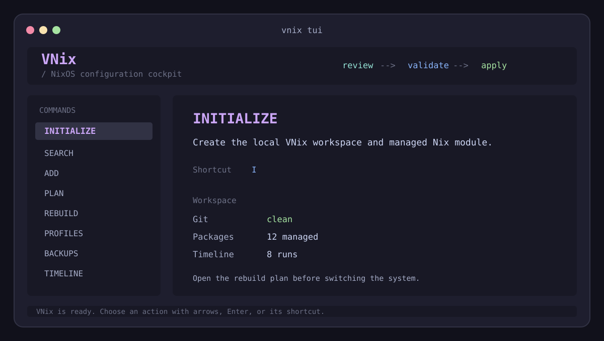

# VNix

> A calm, local-first workspace for managing NixOS package changes.

VNix keeps package edits scoped to one marked Nix file, lets you review and validate a change before switching the system, and stores rebuild history locally in SQLite.



## Why VNix?

NixOS makes changes reproducible. VNix makes the everyday workflow easier to review:

```text
search or choose packages -> edit only the managed block -> review the diff
-> run preflight checks -> rebuild -> inspect local history or restore a backup
```

- **Scoped edits**: packages are changed only between `# vnix:start` and `# vnix:end`.
- **Preview first**: inspect the Git diff and run NixOS preflight checks before activation.
- **Local audit trail**: rebuild duration, result, exit code, and pending diff metrics live in `.vnix/stats.db`.
- **Recovery path**: package edits create compressed backups; restore validates an archive before writing files.
- **Safe Git defaults**: VNix never commits or pushes unless those actions are explicitly enabled.

## TUI

Run `vnix tui` for a keyboard-driven control panel. It provides the dashboard shown above plus forms and tables for package search, preflight plans, package profiles, backups, NixOS generations, drift checks, rebuild history, security scans, and optional AI patch previews.

The interface never applies an AI patch without explicit confirmation. Rebuild is also preceded by a diff review.

## Quick Start

### 1. Build

```bash
go build -o vnix ./cmd/vnix
```

### 2. Initialize a NixOS configuration repository

```bash
cd /path/to/your/nixos-config
vnix init
```

Import the generated module from your NixOS configuration:

```nix
imports = [ ./modules/vnix_packages.nix ];
```

### 3. Add and apply packages

```bash
vnix search firefox
vnix install ripgrep fd
vnix plan
vnix rebuild
vnix stats
```

`search` needs `nix` and `fzf`. The rebuild command must be suitable for the current user and host.

## Commands

| Command | Purpose |
| --- | --- |
| `vnix tui` | Open the interactive terminal UI. |
| `vnix init` | Create local VNix state and the managed Nix module. |
| `vnix search [--branch BRANCH] QUERY` | Search nixpkgs, rank results, and select packages with `fzf`. |
| `vnix install PACKAGE...` | Add valid package attributes to the managed marker block. |
| `vnix plan` | Show pending changes and run flake, dry-build, and dry-activate checks. |
| `vnix rebuild` | Run the configured rebuild command and save a local record. |
| `vnix packages [list\|set ...]` | Inspect or replace the managed package set. |
| `vnix profile [list\|save\|apply]` | Save and apply named package sets. |
| `vnix backups [list\|restore NAME]` | List or restore managed configuration snapshots. |
| `vnix generations [list\|switch NUMBER]` | Inspect or switch NixOS generations. |
| `vnix drift` | Compare Git state, active system, and profile state. |
| `vnix security [run\|set COMMAND]` | Run a user-configured security scanner. |
| `vnix stats` | Read rebuild analytics from SQLite. |
| `vnix ai-patch [propose\|apply]` | Propose or explicitly apply an OpenCode patch. |

## Configuration

`vnix init` writes `.vnix/config.json`:

```json
{
  "managed_packages_file": "modules/vnix_packages.nix",
  "rebuild_command": "nixos-rebuild switch --flake . --quiet",
  "nixpkgs_branch": "nixos-unstable",
  "git_add": false,
  "git_commit": false,
  "git_push": false
}
```

`managed_packages_file` must stay inside the project. If Git actions are explicitly enabled, VNix stages only that file, never `git add .`.

## Safety Model

- Package names are validated before files are changed.
- VNix preserves everything outside the exact marker block.
- Every package edit and rebuild creates a backup in `.vnix/backups/`.
- A backup is completely read and validated before restoration begins; a safety backup is made first.
- API keys are stored in `$XDG_CONFIG_HOME/vnix/` with owner-only permissions.
- Hooks, rebuild commands, security scans, and AI patch application execute user-supplied commands. Review them as you would any local script.

## Requirements

- NixOS configuration repository with Git.
- Go 1.25 or newer to build from source.
- `nix`, `nixos-rebuild`, and `git` for their respective commands.
- `fzf` for interactive CLI search.

## Development

```bash
gofmt -w cmd/vnix/*.go
go build ./...
```

CI runs the build and test suite on pushes and pull requests to `main`.

## Limitations

VNix manages package attributes in one Nix module; it does not replace a full NixOS configuration manager. Run `vnix plan` before `vnix rebuild`, verify external commands for your machine, and keep normal NixOS generation rollback available.

## License

[MIT](LICENSE)
