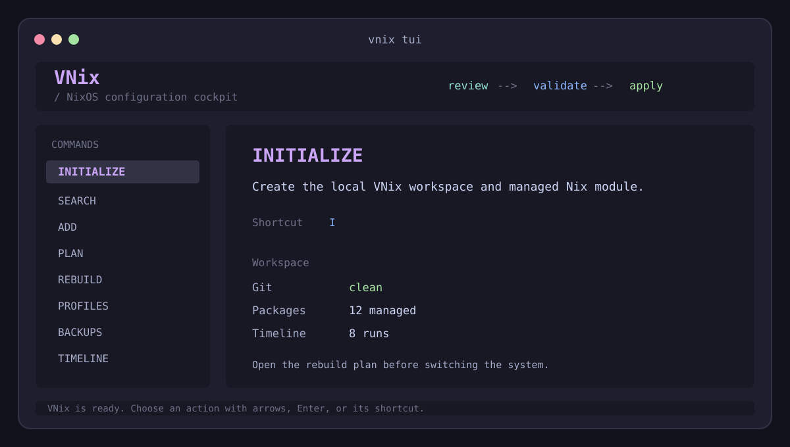

# VNix

> A calm, local-first workspace for managing NixOS package changes.

VNix keeps package edits scoped to one marked Nix file, lets you review and validate a change before switching the system, and stores rebuild history locally in SQLite.



## Why VNix?

NixOS makes changes reproducible. VNix makes the everyday workflow easier to review:

```text
search or choose packages -> edit only the managed block -> review the diff
-> run preflight checks -> rebuild -> inspect local history or restore a backup
```

- **Scoped edits**: packages are changed only between `# vnix:start` and `# vnix:end`.
- **Preview first**: inspect the Git diff and run NixOS preflight checks before activation.
- **Local audit trail**: rebuild duration, result, exit code, and pending diff metrics live in `.vnix/stats.db`.
- **Recovery path**: package edits create compressed backups; restore validates an archive before writing files.
- **Safe Git defaults**: VNix never commits or pushes unless those actions are explicitly enabled.

## TUI

Run `vnix tui` for a keyboard-driven control panel. It provides the dashboard shown above plus forms and tables for package search, preflight plans, package profiles, backups, NixOS generations, drift checks, rebuild history, security scans, and optional AI patch previews.

The interface never applies an AI patch without explicit confirmation. Rebuild is also preceded by a diff review.

## Quick Start

### 1. Build

```bash
go build -o vnix ./cmd/vnix
```

### 2. Initialize a NixOS configuration repository

```bash
cd /path/to/your/nixos-config
vnix init
```

Import the generated module from your NixOS configuration:

```nix
imports = [ ./modules/vnix_packages.nix ];
```

### 3. Add and apply packages

```bash
vnix search firefox
vnix install ripgrep fd
vnix plan
vnix rebuild
vnix stats
```

`search` needs `nix` and `fzf`. The rebuild command must be suitable for the current user and host.

## Commands

| Command | Purpose |
| --- | --- |
| `vnix tui` | Open the interactive terminal UI. |
| `vnix init` | Create local VNix state and the managed Nix module. |
| `vnix search [--branch BRANCH] QUERY` | Search nixpkgs, rank results, and select packages with `fzf`. |
| `vnix install PACKAGE...` | Add valid package attributes to the managed marker block. |
| `vnix plan` | Show pending changes and run flake, dry-build, and dry-activate checks. |
| `vnix rebuild` | Run the configured rebuild command and save a local record. |
| `vnix packages [list\|set ...]` | Inspect or replace the managed package set. |
| `vnix profile [list\|save\|apply]` | Save and apply named package sets. |
| `vnix backups [list\|restore NAME]` | List or restore managed configuration snapshots. |
| `vnix generations [list\|switch NUMBER]` | Inspect or switch NixOS generations. |
| `vnix drift` | Compare Git state, active system, and profile state. |
| `vnix security [run\|set COMMAND]` | Run a user-configured security scanner. |
| `vnix stats` | Read rebuild analytics from SQLite. |
| `vnix ai-patch [propose\|apply]` | Propose or explicitly apply an OpenCode patch. |

## Configuration

`vnix init` writes `.vnix/config.json`:

```json
{
  "managed_packages_file": "modules/vnix_packages.nix",
  "rebuild_command": "nixos-rebuild switch --flake . --quiet",
  "nixpkgs_branch": "nixos-unstable",
  "git_add": false,
  "git_commit": false,
  "git_push": false
}
```

`managed_packages_file` must stay inside the project. If Git actions are explicitly
enabled, VNix stages only that file unless `git_add_all` is explicitly enabled.

### Rebuild automation

`vnix rebuild` always runs the configured rebuild for pending changes, including
documentation changes. There is no sync-only mode. Set `skip_unchanged` to `false`
to also rebuild a clean repository. CLI and TUI use the same settings.

| Setting | Default | Effect |
| --- | --- | --- |
| `git_add` | `false` | Enable staging; required by the built-in commit/push workflow. |
| `git_add_all` | `false` | Stage all project changes, including new files and deletions; otherwise stage only the managed package file. |
| `git_add_before_rebuild` | `true` | Stage before building so Git flakes include new files. Staging runs again after successful rebuild/hooks. |
| `git_commit` | `false` | Commit staged changes after success. An empty index skips commit. |
| `git_push` | `false` | Push after success; requires enabled staging and commits. |
| `git_push_remote`, `git_push_branch` | empty | Optional push destination; a branch requires a remote. Empty values use Git's configured upstream. |
| `git_push_force` | `false` | Use `--force-with-lease`, which rejects overwriting remote changes not present in the local remote-tracking ref. |
| `git_ssh_command` | empty | Set `GIT_SSH_COMMAND` only for VNix's push process. |
| `git_user_name`, `git_user_email` | empty | Optional repository-local identity overrides; otherwise use existing Git identity. |
| `skip_unchanged` | `true` | Skip a rebuild when the worktree and index are clean. |
| `rebuild_backup` | `true` | Make the existing managed-file/config backup before rebuild. This does not back up the entire repository. Package-edit backups remain enabled. |
| `record_stats` | `true` | Save workflow results to SQLite. |
| `ai_commit_message` | `true` | Generate commit messages; `false` always uses a timestamp. |
| `commit_message_command` | empty | Shell command that prints a message, e.g. `aic -p`. It sees the staged diff. Errors, empty output or a two-minute timeout use a timestamp fallback. Empty setting uses built-in Gemini/Ollama. |
| `ai_diagnosis` | `true` | Ask OpenCode to explain workflow failures. |
| `hooks_enabled` | `true` | Run configured hook arrays; `false` disables all hooks. Empty an individual array to disable that phase. |
| `hooks_continue_on_error` | `false` | Print hook failures and continue instead of stopping the workflow. |

The order is backup, optional staging, `before_rebuild`, rebuild, `after_rebuild`,
optional security scan, staging, `before_commit`, commit, `after_commit`, push,
`after_push`, statistics. `after_commit` only runs if a commit was created.
An empty `security_scan_command` disables the scan. A failed rebuild prevents
post-rebuild hooks, commits and pushes. Files staged before a failure remain
staged, as with a manual `git add`; the working files are not reverted.
Pending previews and diff metrics include untracked file contents.
The statistics result covers the whole workflow: a later Git failure can record
failure even after the system was activated. Ignored hook failures are warnings.

Run VNix as your normal user and elevate only the rebuild command, for example
`sudo -n /run/current-system/sw/bin/nixos-rebuild switch --flake . --quiet` when
passwordless sudo is configured. Interactive commands also inherit the terminal
input. VNix does not modify global Git configuration or automatically switch users.

### Profile README hook

`scripts/update-profile-stats.sh` reproduces the rebuild count, daily average,
last-update badges, profile commit and profile push from a typical rebuild helper.
It is optional and uses Bash, Git and Python 3's standard library. Keep this
personal integration in an `after_rebuild` hook:

```json
"after_rebuild": [
  "bash /path/to/VNix/scripts/update-profile-stats.sh .vnix/profile.env"
]
```

The optional settings file is sourced as shell code and exported to the updater:

```bash
PROFILE_ENABLED=1
PROFILE_REPO_PATH=/path/to/profile-repository
PROFILE_BRANCH=main
PROFILE_REMOTE=origin
PROFILE_README=README.md
PROFILE_BIRTH_DATE=2026-02-13
PROFILE_PULL=1
PROFILE_UPDATE_BADGES=1
PROFILE_COMMIT=1
PROFILE_PUSH=1
# Optional for both pull and push:
# GIT_SSH_COMMAND='ssh -i /path/to/key -o IdentitiesOnly=yes'
```

Set any action toggle to `0` to disable it; `PROFILE_ENABLED=0` skips the whole
hook. The repository must be clean and on the configured branch. Pull uses
`--ff-only`; push is ordinary, as in the original profile helper. All three badges
are validated before an atomic README replacement. The count starts at the
existing README value; it is separate from local VNix SQLite history.
With `PROFILE_COMMIT=0`, changes are left for manual review and push is skipped.
Commit or revert them before the next hook run. The counter advances after each
successful system command, even if a later config commit/push fails.

## Safety Model

- Package names are validated before files are changed.
- VNix preserves everything outside the exact marker block.
- Every package edit and rebuild creates a backup in `.vnix/backups/`.
- A backup is completely read and validated before restoration begins; a safety backup is made first.
- API keys are stored in `$XDG_CONFIG_HOME/vnix/` with owner-only permissions.
- Hooks, rebuild commands, security scans, and AI patch application execute user-supplied commands. Review them as you would any local script.

## Requirements

- NixOS configuration repository with Git.
- Go 1.25 or newer to build from source.
- `nix`, `nixos-rebuild`, and `git` for their respective commands.
- `fzf` for interactive CLI search.

## Development

```bash
gofmt -w cmd/vnix/*.go
go build ./...
```

CI runs the build and test suite on pushes and pull requests to `main`.

## Limitations

VNix manages package attributes in one Nix module; it does not replace a full NixOS configuration manager. Run `vnix plan` before `vnix rebuild`, verify external commands for your machine, and keep normal NixOS generation rollback available.

## License

[MIT](LICENSE)
